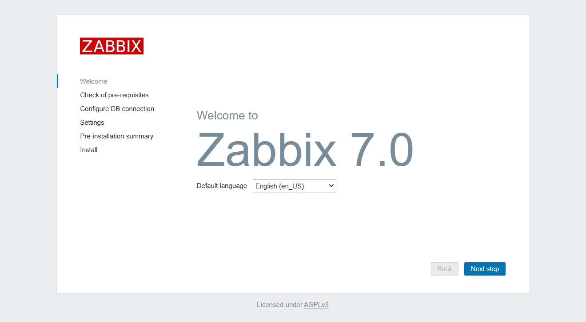
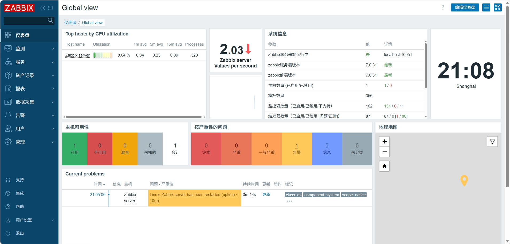
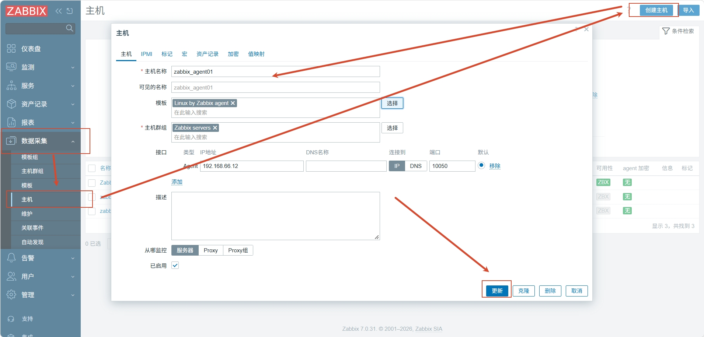
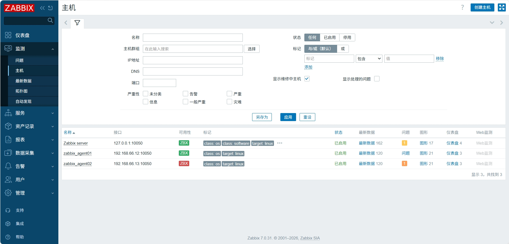

Zabbix 是一套功能强大、可扩展的开源分布式监控系统。它主要用于实时监控 IT 基础设施、网络设备、服务器、虚拟机、云资源、数据库、应用程序和服务的可用性与性能。

# 1. Zabbix 安装
## 1.1 Zabbix-server 安装

在 Zabbix 官网根据需求选择对应的安装方式
```shell
# 1. 安装 Zabbix 官方仓库 （所有节点，后续均为server）
rpm -Uvh https://repo.zabbix.com/zabbix/7.0/rocky/10/x86_64/zabbix-release-latest-7.0.el10.noarch.rpm # 下载并安装适用于 Rocky Linux 10 x86_64 架构的 Zabbix 7.0 官方仓库 RPM 包

dnf clean all # 清除 dnf 的缓存，让新配置的仓库生效

# 2. 安装Zabbix server，Web前端，agent
dnf install zabbix-server-mysql zabbix-web-mysql zabbix-nginx-conf zabbix-sql-scripts zabbix-selinux-policy zabbix-agent

# 3. 安装数据库mariadb
dnf install mariadb-server -y # 安装数据库mariadb
systemctl enable --now mariadb # 启动数据库，并配置开机自动启动
ss -tnupl|grep 3306 # 查看3306端口
mysql_secure_installation # 设置mariadb-server登录密码

# 4. 创建初始数据库
mysql -uroot -p
MariaDB [(none)]> create database zabbix character set utf8 collate utf8_bin; # 创建zabbix库，使zabbix数据库采用utf8的编码
MariaDB [(none)]> create user zabbix@localhost identified by '123456'; # 创建本地数据库用户zabbix，密码设置为'123456'
MariaDB [(none)]> grant all privileges on zabbix.* to zabbix@localhost; # 授予zabbix用户对zabbix数据库的所有权限
MariaDB [(none)]> quit;

# 5. 导入初始架构和数据，系统将提示您输入新创建的密码
zcat /usr/share/zabbix-sql-scripts/mysql/server.sql.gz | mysql --default-character-set=utf8mb4 -uzabbix -p zabbix

# 6. 为Zabbix server配置数据库,编辑配置文件 /etc/zabbix/zabbix_server.conf 使 DBPassword=password

# 7. 为Zabbix前端nginx配置PHP
vim /etc/nginx/conf.d/zabbix.conf
#打开注释并定义端口#        listen          8080;
                #        server_name     example.com;

# 8. 修改前端显示时区
vim /etc/php-fpm.d/zabbix.conf
# 取消注释，改成Asia/Shanghai
php_value[date.timezone] = Asia/Shanghai

# 9. 启动服务zabbix-server zabbix-agent nginx php-fpm
systemctl restart zabbix-server zabbix-agent nginx php-fpm
systemctl enable zabbix-server zabbix-agent nginx php-fpm
```

启动服务后即可访问页面




## 1.2  Zabbix-agent 安装
```shell
# 在agent节点上进行操作
dnf install zabbix-agent

cat /etc/zabbix/zabbix_agentd.conf |grep -vE "^$|^#"
#PidFile=/run/zabbix/zabbix_agentd.pid
#LogFile=/var/log/zabbix/zabbix_agentd.log
#LogFileSize=0
#Server=192.168.66.11 # 指定 zabbix server 地 址
#ServerActive=192.168.66.11 # 指定 zabbix server 地 址
#Hostname=zabbix_agent01
#Include=/etc/zabbix/zabbix_agentd.d/*.conf

systemctl restart zabbix-agent
```
界面添加主机即可成功监控


