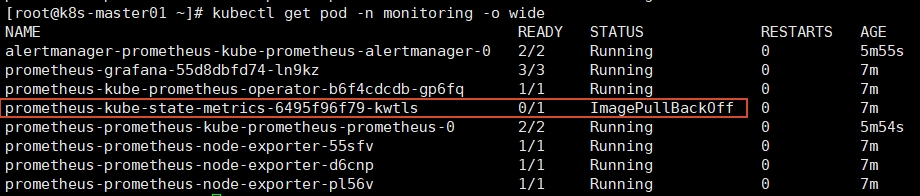
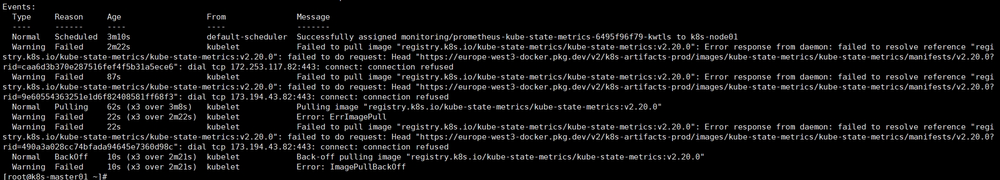

# 安装Helm

> Helm本质是k8s的包管理器。
```shell
dnf install helm #安装helm
helm version #查看helm版本
```

# 安装Prometheus
```shell
# 1. 添加 Prometheus Community 的 Helm 仓库
helm repo add prometheus-community https://prometheus-community.github.io/helm-charts

# 2. 更新本地仓库缓存，以获取最新的图表信息
helm repo update

# 3. 创建独立的命名空间
kubectl create namespace monitoring

# 4. 在 Kubernetes 集群中安装 Prometheus Stack
helm install prometheus prometheus-community/kube-prometheus-stack -n monitoring --set grafana.adminPassword=admin
#--set grafana.adminPassword=admin 设置Grafana admin用户的密码为 admin

# 4.1 如果报错，则可能是网络问题，需检查系统是否设置了代理
env | grep -i proxy

# 4.2 配置代理
export HTTPS_PROXY="http://<代理IP>:端口"
export HTTP_PROXY="http://<代理IP>:端口"
```

安装完成后，get pod 确认全部 pod 是否都已经 run。

发现 state-metrics 错误，describe 查看错误信息

发现 state-metrics 拉取镜像失败
我这里通过本地 docker 来下载并打包到 node1 节点
```shell
# 1. 拉取官方镜像
docker pull registry.k8s.io/kube-state-metrics/kube-state-metrics:v2.20.0

# 2. 将镜像保存为 .tar 文件
docker save -o kube-state-metrics-v2.20.0.tar registry.k8s.io/kube-state-metrics/kube-state-metrics:v2.20.0

# 3. 将 .tar 文件传输到目标节点
scp kube-state-metrics-v2.20.0.tar root@192.168.66.12:/root/

--------node1 执行----------
# 加载镜像到容器运行时
docker load -i /root/kube-state-metrics-v2.20.0.tar

--------master 执行----------
# 删除卡住的 Pod，让其重新创建
kubectl delete pod prometheus-kube-state-metrics-6495f96f79-kwtls -n monitoring
```

查看确认已经全部启动，暴露端口通过浏览器访问
```shell
# 临时测试访问
kubectl port-forward -n monitoring svc/prometheus-grafana 3000:80 --address 0.0.0.0 
```
