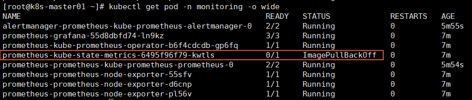
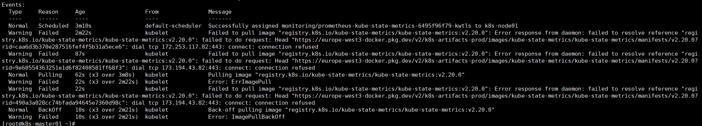

# 安装Helm

> Helm本质是k8s的包管理器。
```shell
dnf install helm #安装helm
helm version #查看helm版本
```

# 安装Prometheus
```shell
# 1. 添加 Prometheus Community 的 Helm 仓库
helm repo add prometheus-community https://prometheus-community.github.io/helm-charts

# 2. 更新本地仓库缓存，以获取最新的图表信息
helm repo update

# 3. 创建独立的命名空间
kubectl create namespace monitoring

# 4. 在 Kubernetes 集群中安装 Prometheus Stack
helm install prometheus prometheus-community/kube-prometheus-stack -n monitoring --set grafana.adminPassword=admin
#--set grafana.adminPassword=admin 设置Grafana admin用户的密码为 admin

# 4.1 如果报错，则可能是网络问题，需检查系统是否设置了代理
env | grep -i proxy

# 4.2 配置代理
export HTTPS_PROXY="http://<代理IP>:端口"
export HTTP_PROXY="http://<代理IP>:端口"
```

安装完成后，get pod 确认全部 pod 是否都已经 run。

发现 state-metrics 错误，describe 查看错误信息

发现 state-metrics 拉取镜像失败
我这里通过本地 docker 来下载并打包到 node1 节点
```shell
# 1. 拉取官方镜像
docker pull registry.k8s.io/kube-state-metrics/kube-state-metrics:v2.20.0

# 2. 将镜像保存为 .tar 文件
docker save -o kube-state-metrics-v2.20.0.tar registry.k8s.io/kube-state-metrics/kube-state-metrics:v2.20.0

# 3. 将 .tar 文件传输到目标节点
scp kube-state-metrics-v2.20.0.tar root@192.168.66.12:/root/

--------node1 执行----------
# 加载镜像到容器运行时
docker load -i /root/kube-state-metrics-v2.20.0.tar

--------master 执行----------
# 删除卡住的 Pod，让其重新创建
kubectl delete pod prometheus-kube-state-metrics-6495f96f79-kwtls -n monitoring
```

查看确认已经全部启动，暴露端口通过浏览器访问
**临时访问：**

- 访问 Prometheus UI：`kubectl port-forward svc/prometheus-kube-prometheus-prometheus 9090:9090 -n monitoring`然后在浏览器中访问 [http://localhost:9090](http://localhost:9090/)
- 访问 Grafana UI：`kubectl port-forward svc/prometheus-grafana 3000:80 -n monitoring`然后在浏览器中访问 [http://localhost:3000](http://localhost:3000/)

**长期访问**

```shell
[root@k8s-master01 ~]# cat monitoring-expose.yaml
---
apiVersion: v1
kind: Service
metadata:
  name: grafana-nodeport
  namespace: monitoring
  labels:
    app.kubernetes.io/name: grafana
    expose: nodeport
spec:
  type: NodePort
  selector:
    app.kubernetes.io/instance: prometheus
    app.kubernetes.io/name: grafana
  ports:
    - name: service
      port: 80
      targetPort: 3000
      nodePort: 30300
      protocol: TCP

---
apiVersion: v1
kind: Service
metadata:
  name: prometheus-nodeport
  namespace: monitoring
  labels:
    app.kubernetes.io/name: prometheus
    expose: nodeport
spec:
  type: NodePort
  selector:
    app.kubernetes.io/name: prometheus
    operator.prometheus.io/name: prometheus-kube-prometheus-prometheus
  ports:
    - name: web
      port: 9090
      targetPort: 9090
      nodePort: 30090
      protocol: TCP

---
apiVersion: v1
kind: Service
metadata:
  name: alertmanager-nodeport
  namespace: monitoring
  labels:
    app.kubernetes.io/name: alertmanager
    expose: nodeport
spec:
  type: NodePort
  selector:
    app.kubernetes.io/name: alertmanager
    alertmanager: prometheus-kube-prometheus-alertmanager
  ports:
    - name: web
      port: 9093
      targetPort: 9093
      nodePort: 30093
      protocol: TCP
      
[root@k8s-master01 ~]# kubectl apply -f monitoring-expose.yaml

[root@k8s-master01 ~]# kubectl get endpoints -n monitoring | grep nodeport
```
**持久化配置**
```shell
kubectl apply -f https://raw.githubusercontent.com/rancher/local-path-provisioner/v0.0.28/deploy/local-path-storage.yaml # 装一个 provisioner，并创建名为 local-path 的 StorageClass。

helm upgrade prometheus prometheus-community/kube-prometheus-stack \
  -n monitoring -f prometheus-values.yaml # 用新的 values 重新渲染全部资源并提交给 K8s。
#[root@k8s-master01 ~]# cat prometheus-values.yaml
#prometheus:
#  prometheusSpec:
#    # 数据保留 15 天，或写到 15GiB 为止（先到先触发）
#    # 注意：retentionSize 必须小于下面申请的 50Gi，留足余量，否则写满会卡住
#    retention: 15d
#    retentionSize: 10GiB
#    storageSpec:
#      volumeClaimTemplate:
#        spec:
#          storageClassName: local-path
#          accessModes: ["ReadWriteOnce"]
#          resources:
#            requests:
#              storage: 15Gi
#
#grafana:
#  adminPassword: "admin"        # 登录密码
#  persistence:
#    enabled: true
#    type: pvc
#    storageClassName: local-path
#    size: 10Gi
#
#alertmanager:
#  alertmanagerSpec:
#    storage:
#      volumeClaimTemplate:
#        spec:
#          storageClassName: local-path
#          accessModes: ["ReadWriteOnce"]
#          resources:
#            requests:
#              storage: 5Gi

kubectl get pvc -n monitoring # 确认三条 PVC 都是 Bound。
```

# 配置 alertmanager 钉钉告警
**1. 创建钉钉机器人**
安全设置选「加签」，记下密钥和 Webhook 链接后的 access_token。
因为 Alertmanager 的 webhook 是固定 JSON 格式，钉钉机器人认的是另一套，所以这个 Deployment 就是中间的格式转换器。
```text
# 钉钉告警转发器：prometheus-webhook-dingtalk
---
apiVersion: v1
kind: Secret
metadata:
  name: dingtalk-config
  namespace: monitoring
type: Opaque
stringData:
  config.yaml: |-
    # 声明自定义模板文件，路径必须和下面 volumeMount 的挂载路径一致
    templates:
      - /etc/prometheus-webhook-dingtalk/custom.tmpl
    targets:
      webhook1:
        url: https://oapi.dingtalk.com/robot/send?access_token=<ACCESS_TOKEN>
        # 安全设置选「加签」时填这一行；选「关键词」的话，把这一整行删除，不能留空
        secret: <SEC_SECRET>
        # 消息标题和正文，引用 custom.tmpl 里定义的模板
        message:
          title: '{{ template "ding.title" . }}'
          text: '{{ template "ding.text" . }}'
        # 想 @ 某个人就填手机号，不需要就删掉下面三行
        # mention:
        #   all: false
        #   mobiles: ['138xxxx8888']
  custom.tmpl: |-
    {{ define "ding.title" }}[{{ .Status | toUpper }}] {{ .CommonLabels.alertname }}{{ end }}

    {{ define "ding.text" }}{{ range .Alerts }}
    ### {{ .Annotations.summary }}

    - **告警名称**: {{ .Labels.alertname }}
    - **级别**: {{ .Labels.severity }}
    - **对象**: {{ .Labels.instance }}
    - **详情**: {{ .Annotations.description }}
    - **触发时间**: {{ .StartsAt.Local.Format "2006-01-02 15:04:05" }}
    {{ end }}{{ end }}
---
apiVersion: apps/v1
kind: Deployment
metadata:
  name: prometheus-webhook-dingtalk
  namespace: monitoring
  labels:
    app: prometheus-webhook-dingtalk
spec:
  replicas: 1
  selector:
    matchLabels:
      app: prometheus-webhook-dingtalk
  template:
    metadata:
      labels:
        app: prometheus-webhook-dingtalk
    spec:
      containers:
        - name: prometheus-webhook-dingtalk
          image: timonwong/prometheus-webhook-dingtalk:v2.1.0
          imagePullPolicy: IfNotPresent
          args:
            - --web.listen-address=:8060
            - --config.file=/etc/prometheus-webhook-dingtalk/config.yaml
            - --log.level=info
          env:
            - name: TZ
              value: Asia/Shanghai
          ports:
            - name: http
              containerPort: 8060
          # 配置文件通过 Secret 挂载，token 不落在镜像和命令行里
          volumeMounts:
            - name: config
              mountPath: /etc/prometheus-webhook-dingtalk
              readOnly: true
            - name: tz
              mountPath: /etc/localtime
              readOnly: true
          readinessProbe:
            httpGet:
              path: /-/healthy
              port: 8060
            initialDelaySeconds: 5
          livenessProbe:
            httpGet:
              path: /-/healthy
              port: 8060
            initialDelaySeconds: 10
          resources:
            requests:
              cpu: 10m
              memory: 32Mi
            limits:
              cpu: 200m
              memory: 128Mi
          securityContext:
            allowPrivilegeEscalation: false
            capabilities:
              drop: ["ALL"]
      volumes:
        - name: config
          secret:
            secretName: dingtalk-config
        - name: tz
          hostPath:
            path: /etc/localtime
            type: File
---
apiVersion: v1
kind: Service
metadata:
  name: prometheus-webhook-dingtalk
  namespace: monitoring
  labels:
    app: prometheus-webhook-dingtalk
spec:
  type: ClusterIP
  selector:
    app: prometheus-webhook-dingtalk
  ports:
    - name: http
      port: 8060
      targetPort: 8060
```
**2. 部署转发器**
```shell
kubectl apply -f alerting/dingtalk-webhook.yaml

kubectl get pod -n monitoring -l app=prometheus-webhook-dingtalk
```
**3. 验证转发器**
```shell
kubectl run curl-test --rm -it --restart=Never -n monitoring \
  --image=curlimages/curl:latest -- sh -c '
curl -s -X POST \
  http://prometheus-webhook-dingtalk.monitoring.svc:8060/dingtalk/webhook1/send \
  -H "Content-Type: application/json" \
  -d "{\"version\":\"4\",\"status\":\"firing\",\"alerts\":[{\"status\":\"firing\",\"labels\":{\"alertname\":\"TestAlert\",\"severity\":\"critical\",\"instance\":\"192.168.66.99:9100\"},\"annotations\":{\"summary\":\"链路测试：这条消息带完整模板\",\"description\":\"看到详细字段说明自定义模板生效\"},\"startsAt\":\"2026-10-07T10:00:00Z\"}]}\"'
```
**4. 把 Alertmanager 接到转发器**
```shell
helm upgrade prometheus prometheus-community/kube-prometheus-stack \
  -n monitoring -f prometheus-values.yaml -f alerting/alertmanager-dingtalk.yaml # 和主 values 一起传，否则持久化和密码配置会被 chart 默认值覆盖
```
alertmanager-dingtalk.yaml：
```yaml
# Alertmanager 路由配置（发钉钉）
---
alertmanager:
  alertmanagerSpec:
    # Alertmanager 保留已解决告警的时长，用于去重判断
    retention: 120h
  config:
    global:
      # 告警消失后多久判定为「已恢复」
      resolve_timeout: 5m
    route:
      receiver: dingtalk
      # 按告警名和级别分组，同组告警合并成同一条消息，避免刷屏
      group_by: ['alertname', 'severity']
      # 新告警产生后先等 30 秒，等同一批次的其它告警一起发
      group_wait: 30s
      # 同一组再次新增告警时的间隔
      group_interval: 5m
      # 告警没恢复时，隔多久重发一次。太短会刷屏，太长会漏
      repeat_interval: 2h
      routes:
        # 子路由按顺序匹配，命中即停，所以具体的要写在前面
        - receiver: dingtalk-fast
          matchers:
            - severity="critical"
          group_wait: 10s
          repeat_interval: 30m
    receivers:
      - name: dingtalk
        webhook_configs:
          - url: http://prometheus-webhook-dingtalk.monitoring.svc:8060/dingtalk/webhook1/send
            send_resolved: true
      - name: dingtalk-fast
        webhook_configs:
          - url: http://prometheus-webhook-dingtalk.monitoring.svc:8060/dingtalk/webhook1/send
            send_resolved: true
```
**5. 测试：加节点宕机告警规则**
`kubectl apply -f alerting/node-down-rule.yaml`

```yaml
# 节点宕机告警规则
# node-down-rule.yaml
---
apiVersion: monitoring.coreos.com/v1
kind: PrometheusRule
metadata:
  name: node-down
  namespace: monitoring
  labels:
    # 必须匹配 Prometheus CR 的 ruleSelector，否则规则不会被加载且不报错
    release: prometheus
spec:
  groups:
    - name: node-down
      rules:
        - alert: NodeExporterDown
          expr: up{job="node-exporter"} == 0
          for: 1m
          labels:
            severity: critical
          annotations:
            summary: 节点 {{ $labels.instance }} 失联
            description: node-exporter 连续 1 分钟抓取失败，节点可能已关机或网络中断，请立即检查。

        # 兜底：机器还活着但 kubelet 上报 NotReady
        - alert: NodeNotReady
          expr: kube_node_status_condition{condition="Ready", status="true"} == 0
          for: 2m
          labels:
            severity: critical
          annotations:
            summary: 节点 {{ $labels.node }} 进入 NotReady
            description: 节点 Ready 条件持续 2 分钟不为 true，可能无法调度新 Pod。
```


