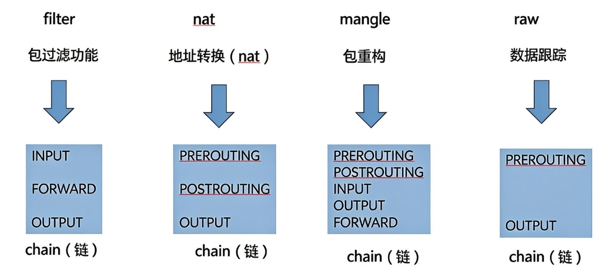
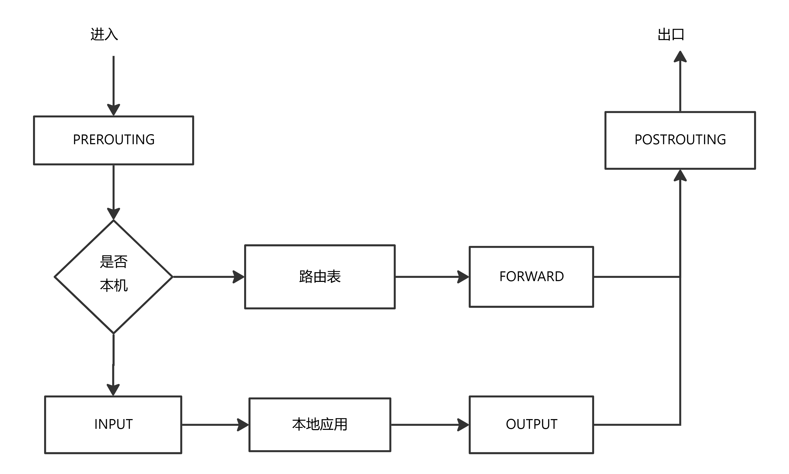

iptables是Linux系统中的一个用户空间工具，用于配置内核提供的IPv4和IPv6包过滤功能。它允许系统管理员根据预定义的规则对网络流量进行控制，从而实现对系统的保护。

# 1. iptables 的组成

- **表（tables）**
提供特定的功能，iptables内置了4个表，即filter表、nat表、mangle表和raw表，分别用于实现包过滤，网络地址转换、包重构(修改)和数据跟踪处理。(优先级 raw > mangle > nat > filter)
- **链（chains）**
是数据包传播的路径，每一条链其实就是众多规则中的一个检查清单，每一条链中可以有一条或数条规则。当一个数据包到达一个链时，iptables就会从链中第一条规则开始检查，看该数据包是否满足规则所定义的条件。如果满足，系统就会根据该条规则所定义的方法处理该数据包；否则iptables将继续检查下一条规则，如果该数据包不符合链中任一条规则，iptables就会根据该链预先定义的默认策略来处理数据包。



# 2. iptables 工作场景
**第一种情况：入站数据流向**
从外界到达防火墙的数据包，先被PREROUTING规则链处理(是否修改数据包地址等），之后会进行路由选择（判断该数据包应该发往何处），如果数据包的目标主机是防火墙本机(比如说Internet用户访问防火墙主机中的web服务器的数据包)，那么内核将其传给INPUT链进行处理（决定是否允许通过等），通过以后再交给系统上层的应用程序(比如Apache服务器）进行响应。

**第二冲情况：转发数据流向**
来自外界的数据包到达防火墙后，首先被PREROUTING规则链处理，之后会进行路由选择，如果数据包的目标地址是其它外部地址（比如局域网用户通过网关访问QQ站点的数据包），则内核将其传递给FORWARD链进行处理（是否转发或拦截），然后再交给POSTROUTING规则链（是否修改数据包的地址等）进行处理。

**第三种情况：出站数据流向**
防火墙本机向外部地址发送的数据包（比如在防火墙主机中测试公网DNS服务器时），首先被OUTPUT规则链处理，之后进行路由选择，然后传递给POSTROUTING规则链(是否修改数据包的地址等）进行处理。


# 3. iptables 规则
```shell
iptables [-t 表名] 命令选项 [链名] [条件匹配] [-j 目标动作或跳转]

#例：iptables -t fileter -A INPUT -p tcp --dport=80 -j DROP # 丢弃 IPv4 的 TCP 入站访问本机 80 端口
```
**iptables 命令图文表示**
| table | command | chain | parameter | target |
| :--- | :--- | :--- | :--- | :--- |
| `-t filter` | `-A` (追加)<br>`-D` (删除)<br>`-I` (插入)<br>`-R` (替换)<br>`-L` (列出)<br>`-F` (清空)<br>`-Z` (清零)<br>`-N` (新建链)<br>`-X` (删除链)<br>`-P` (默认策略) | `INPUT`<br>`FORWARD`<br>`OUTPUT`<br>`PREROUTING`<br>`POSTROUTING` | `-p`<br>`-s`<br>`-d`<br>`-i`<br>`-o`<br>`--sport`<br>`--dport`<br>`...` | `-j ACCEPT`<br>`-j DROP`<br>`-j REJECT` |


**iptables 过滤条件**
| parameters (参数)             | specified (具体说明 / 过滤条件)                              |
| :---------------------------- | :----------------------------------------------------------- |
| **`-p（匹配协议类型）`**                      | `TCP`<br>`UDP`<br>`ICMP`<br>`A protocol name from /etc/protocols`<br>`all` |
| **`-s（匹配源）`** / **`-d（目标 IP 地址）`**           | `network name`<br>`Hostname`<br>`Subnet (192.168.0.0/24 ; 192.168.0.0/255.255.255.0)`<br>`IP address` |
| **`-i (in-interface)`** / **`-o(out-interface)（匹配网卡接口）`**           | `Interface name (eth0)`<br>`interface name ends in a "+" (eth+)` |
| **`--sport（匹配源）`** / **`--dport（目标端口）`** | `Service name`<br>`Port number`<br>`Port range (1024:65535)` |


